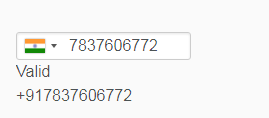

# ionic wrapper for intl-tel-input

# Installation

Run following command to install  ionic-tel-input

```sh
npm install ionic-tel-input intl-tel-input --save
```

After install, you need to add **intlTelInput.css**.

In case of ionic, add **intlTelInput.css** in your variables.scss. For example,
```@import 'intl-tel-input/build/css/intlTelInput.css';```


replace flags folder in intel-tel-input by flags folder exist in module

Now add  ionicTelInputModule into your AppModule. For example,

```js
import { ionicTelInputModule} from ' ionic-tel-input';
```

Once done, we are ready to use this library.

# How to use?

In order to use this directive, you need to add " ionicTelInput" directive with "[ ionicTelInputOptions]" options to your text field. For example,

```html
<input type="text"
   ionicTelInput
  [ionicTelInputOptions]="{initialCountry: 'in'}"
  (hasError)="hasError($event)"
  ( ionicTelOutput)="getNumber($event)"
  (intlTelInputObject)="telInputObject($event)"
  (countryChange)="onCountryChange($event)" />
```

# Note
  * this module used the following module as a reference
    * #####  [ng2-tel-input](https://www.npmjs.com/package/ng2-tel-input)

* modifying the style to meet the ionic mobile style
* modifying the wrapper to refer to the jquery file
* modifying the flags files to meet ionic mobile app


* **(intlTelInputObject)** returns original element which hold **intl-tel-input** instance.

# How to use this instance?
You can use it perform any functionality that is available on intl-tel-input plugin. **For example**, in your component,
```
telInputObject(obj) {
    console.log(obj);
    obj.intlTelInput('setCountry', 'in');
  }
```


